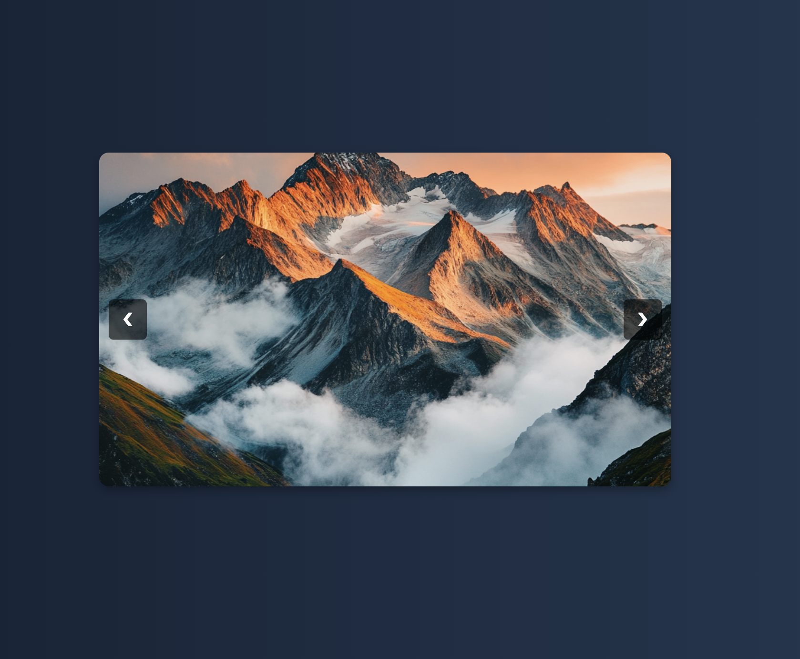

# Day 16: Image Slideshow with Smooth Transitions


## 🎯 Project Overview 
For Day 16 of the 30-Day Coding Challenge, we built a responsive image slideshow/gallery with smooth transitions using HTML, CSS, and JavaScript. This slideshow automatically transitions between images, creating an elegant and seamless effect without showing navigation dots.

## Features
- Smooth Image Transitions: Images slide smoothly without abrupt changes.
- Automatic Slideshow: The images change automatically at intervals.
- Responsive Design: Optimized for desktop and mobile views.
- Customizable Transition Speed: Adjust the duration of slides easily in the CSS/JS.

---

## 🛠️ Technologies Used
- HTML
- CSS (with transitions for smooth effects)
- JavaScript (for toggling answers)

---

# Demo page

Click [Here](https://ayshasanyang.github.io/Day-16-image-slideshow/) to view the page

## 🚀 How to Run
1. Download or clone the repository
```bash
git clone https://github.com/ayshasanyang/Day-16-image-slideshow.git
```
2. Navigate to the project folder.
3. Open the project files in your vscode or any code editor of your choice
4. Open the `index.html` file in your web browser.

---

## 📸 Preview
 

---

Made with ❤️ by [AYSHA] 🚀